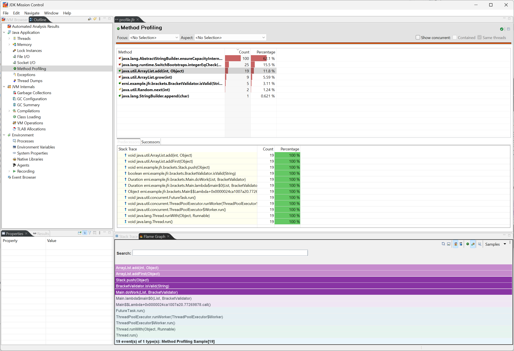
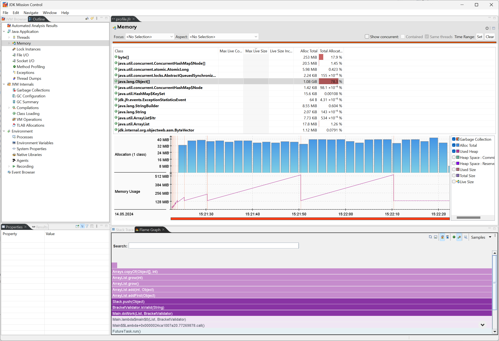

# Profiling using the Java Flight Recorder

## What is the Java (JDK) Flight Recorder?

* An **event based** tracing framework, build **into** the Java Runtime
* Extremely **low overhead (<%1)**, designed for use in production
* With APIs for
  * Producing application level events
  * Analysing events and event streams
* Events can be dumped into a file or streamed over JMX

### GUIs for analysis

* [JDK Mission Control](https://www.oracle.com/missioncontrol) - [Github Repo](https://github.com/openjdk/jmc)
* [VisualVM](https://visualvm.github.io/)
* [Java JFR Profiler](https://plugins.jetbrains.com/plugin/20937-java-jfr-profiler) for IntelliJ

### Where can I use it?

JFR requires OpenJDK 11+ or OpenJDK 8u262 ([release notes](https://mail.openjdk.org/pipermail/jdk8u-dev/2020-July/012143.html))

JMX streaming requires OpenJDK 17+.

### How to use it?

There are lots of configuration knobs. [Azul](https://docs.azul.com/prime/Java-Flight-Recorder) has a good documentation and [Baeldung](https://www.baeldung.com/java-flight-recorder-monitoring) also describes some options.

For our test we start the JFR with JVM parameters. We use the two default profiles that come with the JVM.

1. The [Profiling Profile](./profile.jfc) has around 2% performance overhead  
   `-XX:StartFlightRecording=dumponexit=true,settings=profile,filename=profile.jfr`
2. The [Default Profile](./default.jfc) has around 1% performance overhead and is meant for continuous use in production  
   `-XX:StartFlightRecording=dumponexit=true,settings=default,filename=default.jfr`

#### Basic Options

| Option                                | Description                                                                                                                                                                                                                                                                                                                                                                                             | Default                 |
|---------------------------------------|---------------------------------------------------------------------------------------------------------------------------------------------------------------------------------------------------------------------------------------------------------------------------------------------------------------------------------------------------------------------------------------------------------|-------------------------|
| `name=<identifier>`                   | Specifies a name identifier for the recording. This is useful when working from jcmd and operating multiple recordings running at the same time.                                                                                                                                                                                                                                                        | `1`, `2`, ...           |
| `filename=<filename.jfr>`             | Specifies the file name of the generated recording. You can add a path to the recording filename to change the file location. The recording file stays empty and only gets populated once the recording finishes.                                                                                                                                                                                       | `hotspot-pid-%p-%t.jfr` |
| `dumponexit=<true, false>`            | Controls whether to generate a recording file (dump a recording) if the JVM shuts down and the filename option has not been specified. The dumped recording filename is hotspot-pid-%p-%t.jfr                                                                                                                                                                                                           | `false`                 |
| `disk=<true, false>`                  | Controls whether to create a temporary recording file under the path set in the repository option. Temporary recording means that a file is written to the system temporary directory during the time of the recording and is deleted afterwards. This recording file is populated gradually, unlike the file generated using the filename option, which is only populated once the recording finishes. | `true`                  |
| `repository=<path/to/temp/recording>` | Specifies the path for a temporary recording if the disk option is enabled.                                                                                                                                                                                                                                                                                                                             | `/tmp/`                 |
| `duration=<time in specified unit>`   | Specifies the recording length. Used time units: ns/ms/s/m/h/d. For example, 1800s or 30m.                                                                                                                                                                                                                                                                                                              | `0`, unlimited          |
| `delay=<time in specified unit>`      | Specifies the amount of time that the recorder must wait before starting to record. Used time units: ns/ms/s/m/h/d. For example, 1800s or 30m.                                                                                                                                                                                                                                                          | `0`                     |
| `maxage=<time in specified unit>`     | Specifies the maximum age of collected data                                                                                                                                                                                                                                                                                                                                                             | `0s`, unlimited         |
| `maxsize`                             | Specifies the maximum size of buffers for collected data in bytes                                                                                                                                                                                                                                                                                                                                       | `0`, no max size        |
| `settings=<path/to/settings/file>`    | Specifies the configuration file to be used. In case of a custom configuration file, use the full path to the .jfc file. Otherwise, use one of the presets `default` or `profile`.                                                                                                                                                                                                                      | `default`               |

## Profiling

We are profiling the [BracketValidator](./src/main/java/erni/example/jfr/brackets/BracketValidator.java) class.
It is an implementation of the [Balanced Brackets](https://www.hackerrank.com/challenges/balanced-brackets/problem)
problem from HackerRank.

There are two Gradle tasks set up to run a performance test with the Java Flight Recorder: `runJfrContinuousConfig` and `runJfrProfilingConfig`. 

### Method profiling

### Allocations

## Resources

Blog posts / videos

* [Java Flight Recorder as an Observability Tool](https://www.infoq.com/presentations/jfr-observability/) - [Video](https://www.youtube.com/watch?v=MG6MQLg0zEE)
* [Java's Observability and Monitoring Framework - JFR](https://www.youtube.com/watch?v=XEKkUpPnf4Q)
* [Continuous Monitoring with JDK Flight Recorder](https://www.youtube.com/watch?v=plYESjZ12hM)
* [JDK Flight Recorder – a gem hidden in OpenJDK](https://bell-sw.com/announcements/2020/06/24/Java-Flight-Recorder-a-gem-hidden-in-OpenJDK/)

Tutorials

* [JDK Mission Control Tutorial](https://github.com/thegreystone/jmc-tutorial/)

Integration in APM tools

* [NewRelic](https://docs.newrelic.com/docs/apm/agents/java-agent/features/real-time-profiling-java-using-jfr-metrics/)
* [Azure Application Insights](https://learn.microsoft.com/en-us/azure/azure-monitor/app/java-standalone-profiler)
